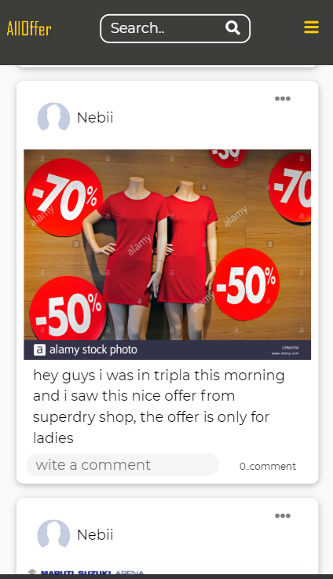
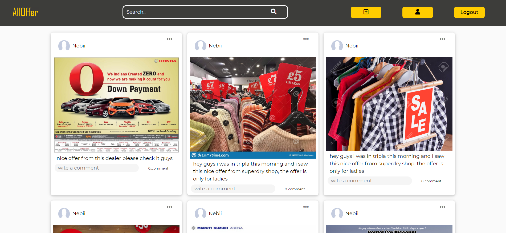

  # alloffer    - web-App   (Rest API)                                                 
 
 ------------------------------------------------------

 ## Discription 
 -------------------------------------------------------
- this is a web media sharing app 
- this app create the platform for shop owners to show what they are offering for customers, and any user can also share a pic of the discount items 
  with other users. 
- using this app  anonymous user can see the post with out creating a post, but 
  registered users has there own profile, so they can login and see others post plus they can see there profile page and they 
  can also delete and edit thier post 
- the app is responsive and done for both mobile and desktop users 

- ### the app is done intentionally using pure html and css, no bootsrap or other framework  is used. 

---

 ## Features  and technologies   
    
 -----------------------------------------------------

 
 |  server  | server os  | app verion  |
 | ---------------- |:-------------:| ----------  |
 |  apache and node express |  Centos 7          |      0-1    |

 
 
 - apache                                          
 - express js 
 - multer
 - vanilla javascript and nodejs  for programming lang 
 - JWT (Rest API)
 - only html and css 

-----------------------------------------------------------

 ## Database   
    
 -----------------------------------------------------
 mysql (mariadb)

---------------------------------------------------------

## Design pattern 

---------------------------------------------------------

 - Model View Controller

-----------------------------------------------------------

## photos

---------------------

                        

 
 
  
  
  
  -------------------------
  "link to the app 
  
  https://10.114.32.141/alloffer/